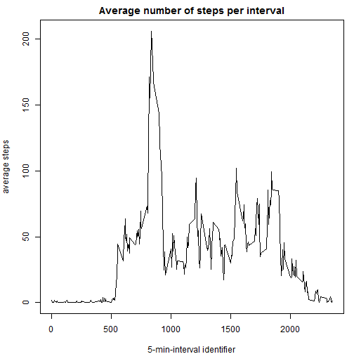

# Programming Assignment 1

## Reproducible Research
### Data Science, Coursera


Before addressing the questions in this assignment, certain packages used in the analysis must be downloaded and loaded into the workspace, as follows:


```r
install.packages("plyr")
```

```
## package 'plyr' successfully unpacked and MD5 sums checked
## 
## The downloaded binary packages are in
## 	C:\Users\Mental\AppData\Local\Temp\Rtmp6lHCOp\downloaded_packages
```

```r
library(plyr)
```


##1. Loading and Processing the Data

The first step in this assignment requires the user to download the data. The following code downloads the data from the URL provided, if this has not already been done. It extracts the data and reads the csv file into an R dataframe object called "data" (does not leave much to the imagination, I know).

```r
if (!file.exists("data.zip")) 
  {url <- "http://d396qusza40orc.cloudfront.net/repdata%2Fdata%2Factivity.zip"}
download.file (url, "data.zip")
if (!file.exists ("activity.csv")) {unzip ("data.zip")}
data <- read.csv("activity.csv",stringsAsFactors=FALSE)
```
Once the data has been loaded, it has to be transformed in such a way so as to introduce a new column containing dates (same as the **date** column), but represented as a factor variable needed for later processing. In addition, the date is converted to a **POSIXlt** format.

```r
data$fDate <- as.factor (data$date)
data$date <- strptime(data$date, format="%Y-%m-%d")
```


##2. What is the Mean Total Number of Steps Taken per Day?

To answer this question, the mean number of steps taken per day must first be calculated. This is done using the **ddply** function from the **plyr** package in order to summarise the data. The resulting new data frame is then used to construct a histogram.

```r
data_step_sums_day <- ddply (data, .(date), summarise, stepsum=sum(steps))
hist(data_step_sums_day$stepsum, col="blue", main="Distribution of total 
     number of steps taken per day", xlab="Total number of stpes",
     ylab="Number of days")
```

 

A different approach is adopted to obtain the mean and median steps made for each day - using the **aggregate** function. Here, the data are summarised giving the mean and the median and are then plotted for visualization. I consider this to be a much better way of drawing conclusions and making observations than giving tables with values (way too dry and uninteresting).

```r
data_step_mean_day <- aggregate(steps~fDate, data=data, FUN=mean)
data_step_mean_day$fDate <- strptime(as.character(data_step_mean_day$fDate), 
                                     format="%Y-%m-%d")
data_step_median_day <- aggregate(steps~fDate, data=data, FUN=median)
data_step_median_day$fDate <- strptime(as.character(data_step_median_day$fDate), 
                                     format="%Y-%m-%d")
par(mfrow=c(1,2), mar=c(4,2,2,1))
with(data_step_mean_day, { plot (fDate, steps, ylab="average steps", 
                          xlab="date", main="Steps mean per day",
                          col="red", pch=20)})
with(data_step_median_day, { plot (fDate, steps, ylab="median steps", 
                            xlab="date", main="Median steps per day",
                            col="green", pch=20)})
```

 


## What is the Average Daily Activity Pattern?

In this part of the assignment, the average number of steps taken is represented as a function of the time of the day (i.e. the **interval** identifier). The code follows the same principle as for the question above.

```r
data_step_mean_interval <- aggregate (steps~interval, data=data, FUN=mean)
par (mfrow=c(1,1), mar=c(4,4,2,1))
with (data_step_mean_interval, { plot(interval, steps, type="l", 
                  xlab="interval identifier",
                  ylab="average steps",
                  main="Average number of steps per interval",
      )})
```

 

The following code and result correspond to obtaining the 5-minute-interval displaying the maximum average number of steps.

```r
max <- max(data_step_mean_interval$steps)
print(data_step_mean_interval$interval[which.max(data_step_mean_interval$steps)])
```

```
## [1] 835
```


## Imputing Missing Values

1. First we should check if there are any missing values for any of the variables present in the table and print the sum of the missing values for recordings of the steps taken.


```r
any (is.na(data$date))
```

```
## [1] FALSE
```

```r
any (is.na(data$interval))
```

```
## [1] FALSE
```

```r
any (is.na(data$steps))
```

```
## [1] TRUE
```

```r
print (sum(is.na(data$steps)))
```

```
## [1] 2304
```

2. The strategy I adopted for filling in missing values is by using the average for the 5min time interval accross all days. In my opinion, this is a more accurate representation compared to substituting with the average number of steps taken for that particular day.

3. A new data frame is created following the strategy described above. In brief, the dataframe containing mean **step** values for the **intervals** is merged to the initial dataframe. The *NA** values are then substituted with the corresponding averages.

```r
colnames(data_step_mean_interval)[2] <- "average"
fdata <- merge(data, data_step_mean_interval, by="interval")
fdata$steps[is.na(fdata$steps)] <- fdata$average[is.na(fdata$steps)]
fdata <- fdata[,-c(4,5)]
fdata$date <- as.factor(as.character(fdata$date))
```

4. A histogram is constructed using this new modified dataset. Sums were obtained as previously described beforehands.

```r
fdata_step_sums_day <- ddply (fdata, .(date), summarise, stepsum=sum(steps))
hist(fdata_step_sums_day$stepsum, col="blue", main="Distribution of total 
     number of steps taken per day", xlab="Total number of stpes",
     ylab="Number of days")
```

 

The mean and median steps per day are calculated as before and reported under graphical form.

```r
fdata_step_mean_day <- aggregate(steps~date, data=fdata, FUN=mean)
fdata_step_mean_day$fDate <- strptime(as.character(fdata_step_mean_day$date), 
                                     format="%Y-%m-%d")
fdata_step_median_day <- aggregate(steps~date, data=fdata, FUN=median)
fdata_step_median_day$fDate <- strptime(as.character(fdata_step_median_day$date), 
                                       format="%Y-%m-%d")

par(mfrow=c(1,2), mar=c(4,2,2,1))
with(fdata_step_mean_day, { plot (fDate, steps, ylab="average steps", 
                                 xlab="date", main="Steps mean per day",
                                 col="red", pch=20)})
with(fdata_step_median_day, { plot (fDate, steps, ylab="median steps", 
                                   xlab="date", main="Median steps per day",
                                   col="green", pch=20)})
```

 

We can see that there are patterns that start to emmerge especially when considering the **median**. This probably corresponds to time of the day. Generally, the average values per day are higher than when **NA** values are not imputed. 


## Plot Weekend Vs. Weekdays

To address this issue, we create a new variable that indicates the day of the week. Then, we substitute the day of the week with a weekend or weekday depending on whether it contains "Sat" or "Sun", or not.


```r
weekend <- c("Sat", "Sun")
fdata$date <- as.POSIXlt(as.character(fdata$date))
fdata$day <- weekdays(fdata$date, abbreviate=TRUE)
fdata[fdata$day %in% weekend,4] <- "Weekend" 
fdata[fdata$day != "Weekend",4] <- "Weekday"
fdata_weekday <- fdata[fdata$day=="Weekday",]
fdata_weekend <- fdata[fdata$day=="Weekend",]
fdata_step_weekday <- aggregate (steps~interval, data=fdata_weekday, FUN=mean)
fdata_step_weekend <- aggregate (steps~interval, data=fdata_weekend, FUN=mean)
par (mfrow=c(2,1), mar=c(4,4,2,1))
with (fdata_step_weekday, { plot(interval, steps, type="l", 
                                      xlab="interval identifier",
                                      ylab="average steps",
                                      main="Weekdays"
)})
with (fdata_step_weekend, { plot(interval, steps, type="l", 
                                 xlab="interval identifier",
                                 ylab="average steps",
                                 main="Weekend"
)})
```

 

It appears that there is more uniform movement throughout the day on the weekend.
